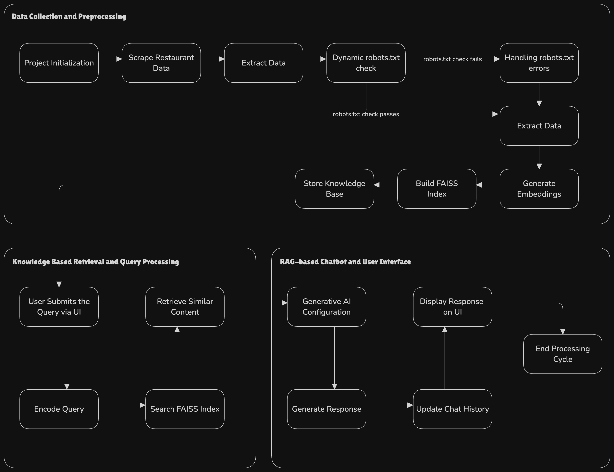

# Nugget AI Smart Search Chatbot

## Overview

The Nugget AI Smart Search Chatbot is an end-to-end Generative AI solution designed to answer natural language questions about restaurants using a Retrieval-Augmented Generation (RAG) approach combined with dynamic web scraping. It gathers live restaurant data from multiple websites (with dynamic robots.txt checks), processes the data into a knowledge base, and leverages Google’s Gemini 2.0 Flash model to generate context-aware responses via an interactive Streamlit UI.

## Features

- **Dynamic Web Scraping with Live `robots.txt` Check:**  
  Scrapes restaurant details (name, type, location, operating hours, and contact information) from live websites using BeautifulSoup and Requests. For every URL, the scraper dynamically fetches the site's `robots.txt` to determine if scraping is permitted, ensuring ethical data collection along with robust error handling.

- **Knowledge Base Creation & Retrieval:**  
  Processes the scraped data by generating embeddings with a pre-trained Sentence Transformer (`all-MiniLM-L6-v2`). Constructs an efficient FAISS index for similarity search and saves the resulting raw texts and embeddings as a serialized knowledge base.

- **RAG-based Chatbot with Generative AI:**  
  Uses Google’s Gemini 2.0 Flash model (enabled for all clients) to generate responses by combining user queries with relevant context retrieved from the knowledge base. The chatbot maintains conversation history via Streamlit’s session state for multi-turn dialogue.

- **Interactive User Interface:**  
  A user-friendly Streamlit UI, which includes distinct components for header, sidebar (conversation history), chat form, chat display, and footer.

## Flowchart 


## Installation & Setup

1. **Clone the Repository:**
    ```sh
    git clone https://github.com/your_username/GENAI_Assignment_Nugget_By_Zomato.git
    cd GENAI_Assignment_Nugget_By_Zomato
    ```

2. **Create and Activate a Virtual Environment:**
    ```sh
    python -m venv venv
    source venv/bin/activate   # On Linux/macOS
    # On Windows use: venv\Scripts\activate
    ```

3. **Install Dependencies:**
    ```sh
    pip install -r requirements.txt
    ```

4. **Configure Environment Variables:**
    - Create a `.env` file in the project root by copying the sample and adding your Gemini API key:
      ```
      API_KEY=YOUR_GEMINI_API_KEY_HERE
      ```
      This key must be obtained from the official Gemini website and is required for accessing Google’s Gemini 2.0 Flash model. The application only works when the API key is correctly set.

5. **Run Data Preprocessing(Optional):**
    - Execute the preprocessing script to scrape the restaurant data, generate embeddings, and build the knowledge base:
      ```sh
      python preprocess.py
      ```
      This process uses the functions in [`scraper/data_collection.py`](scraper/data_collection.py) for dynamic web scraping (with live `robots.txt` checks) and those from [`pipeline/creating_embeddings.py`](pipeline/creating_embeddings.py) for embedding generation and FAISS indexing. The final output is stored in `knowledge_base/text_extracted_list.pkl`.

6. **Launch the Application:**
    Start the Streamlit application:
    ```sh
    streamlit run app.py
    ```
    The deployed app is available at: [Link](https://raghavakamuju-genai-assignment-nugget-by-zomato-app-wftjcu.streamlit.app/)

## Folder Structure

```
.
├── .env                   # Environment variables (API key)
├── .env.example           # Sample environment variable file
├── .gitignore             # Files/directories to be ignored by Git
├── app.py                 # Main Streamlit application
├── preprocess.py          # Script to perform data collection and knowledge base creation
├── README.md              # This project documentation file
├── requirements.txt       # Dependency list
├── docs/                  # Additional documentation
│   ├── architecture.md    # Detailed system architecture (this document)
│   ├── implementation.md  # Component-wise implementation details
│   ├── challenges.md      # Challenges encountered and solutions
│   └── future.md          # Future improvement opportunities
├── knowledge_base/        # Serialized knowledge base file
│   └── text_extracted_list.pkl
├── pipeline/              # Data processing and indexing modules
│   ├── creating_embeddings.py
│   ├── data_manager.py
│   ├── extracting_similar_content.py
│   └── __init__.py
├── rag_chatbot/           # Generative AI configuration and response modules
│   ├── generative_ai_utils.py
│   └── __init__.py
├── scraper/               # Web scraping modules
│   ├── data_collection.py
│   ├── class_names.txt    # CSS selectors configuration for scraping
│   └── __init__.py
└── ui/                    # Streamlit UI components
    ├── header.py
    ├── sidebar.py
    ├── chat_form.py
    ├── chat_display.py
    ├── footer.py
    ├── gemini_response.py
    └── __init__.py
```

## Code Walkthrough

### Main Application ([app.py](app.py))
- **Initialization:**  
  Loads the API key from the `.env` file and imports the preprocessed knowledge base (restaurant texts and embeddings).
  
- **Indexing:**  
  Builds a FAISS index using the embedding array to enable similarity search.

- **Generative AI Setup:**  
  Configures Google’s Gemini 2.0 Flash model via [`rag_chatbot/generative_ai_utils.py`](rag_chatbot/generative_ai_utils.py).

- **User Interaction:**  
  Renders the header, sidebar, and chat components from the UI modules. Encodes user queries, retrieves similar restaurant data from the FAISS index, passes context to the Gemini AI model, and updates conversation history.

### Data Preprocessing ([preprocess.py](preprocess.py))
- Integrates scraping via dynamic web scraping functions in [`scraper/data_collection.py`](scraper/data_collection.py).
- Generates text embeddings and builds the FAISS index.
- Saves the final knowledge base to `knowledge_base/text_extracted_list.pkl`.

### Web Scraping ([scraper/data_collection.py](scraper/data_collection.py))
- **Dynamic `robots.txt` Checking:**  
  For each restaurant URL, it dynamically fetches the live `robots.txt` file to check scraping permissions.
  
- Uses BeautifulSoup to parse HTML and extract data based on selectors from [`scraper/class_names.txt`](scraper/class_names.txt).
- Robust error handling ensures that the scraping continues even if individual URLs fail.

### Retrieval & Generative AI ([rag_chatbot/generative_ai_utils.py](rag_chatbot/generative_ai_utils.py))
- Configures and accesses Google’s Gemini 2.0 Flash model to generate context-aware responses.
- Combines retrieved context (from the FAISS index) and the user query to formulate coherent responses.

### User Interface ([ui/](ui/))
- The UI is modularized into header, sidebar, chat form, chat display, and footer components for clarity and reusability.
- Uses Streamlit’s session state to maintain conversation history, facilitating multi-turn interactions.

## Documentation

For further details on system design, implementation specifics, challenges, and future improvements, please refer to the additional documents in the [docs/](docs/) folder:
- **docs/architecture.md** – In-depth system architecture details.
- **docs/implementation.md** – Detailed component implementation.
- **docs/challenges.md** – Challenges faced and solutions implemented.
- **docs/future.md** – Future improvement opportunities.
- **docs/limitations.md** - Provides information about the limitations of the RAG Chatbot.

## Demo Video

[Watch the Demo Video on Google Drive](https://drive.google.com/file/d/19UdBPJfA38iDpybqaXnNCCaPZIHI0kGx/view?usp=sharing)
